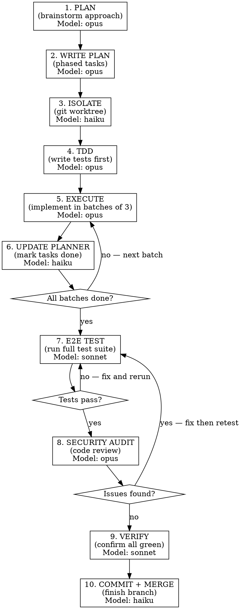

# Block Execution Workflow

Structured workflow for executing a daily planner block. Every block goes through all steps -- no shortcuts.

## Trigger

Start this workflow when:
- Beginning a BUILD, EXPLORE, or MARKET block from the daily planner
- User says "let's start Block 1/2/3" or "let's work on today's tasks"
- User says "start the block"

## Workflow



## Steps

### 1. PLAN — Brainstorm approach
**Model: opus** (architectural decisions need maximum reasoning)
**Skill:** `superpowers:brainstorming`

- Read the daily planner block tasks
- Understand what needs to be built
- Identify dependencies between tasks
- Design the approach (data flow, architecture, patterns)
- Get user approval on the design

### 2. WRITE PLAN — Create phased implementation plan
**Model: opus** (comprehensive planning needs deep codebase understanding)
**Skill:** `superpowers:writing-plans`

- Break the approved design into bite-sized tasks
- Group into batches of 3
- Define acceptance criteria per task
- Save plan to `docs/plans/YYYY-MM-DD-<topic>-impl.md`

### 3. ISOLATE — Git worktree
**Model: haiku** (mechanical git operations)
**Skill:** `superpowers:using-git-worktrees`

- Create a git worktree for this block's work
- Verify clean working directory
- Branch naming: `block/<date>-<block-name>` (e.g., `block/2026-02-22-build`)

### 4. TDD — Write tests first
**Model: opus** (writing good tests requires understanding edge cases and invariants)
**Skill:** `superpowers:test-driven-development`

- Write tests BEFORE implementation code
- Cover: happy path, edge cases, error conditions, security boundaries
- For extractions: test that no `brain.*` or `soul.*` imports remain
- For new code: test core functionality and boundary conditions
- Run tests — confirm RED (failing)

### 5. EXECUTE — Implement in batches of 3
**Model: sonnet** (tests constrain the work — implementation is well-defined)
**Skill:** `superpowers:executing-plans`

- Implement 3 tasks per batch
- After each batch: report what was done, show verification output
- **STOP and wait for user feedback** before next batch
- Run tests after each batch — confirm GREEN (passing)
- Code review between batches using `superpowers:requesting-code-review`

### 6. UPDATE PLANNER — Mark tasks done
**Model: haiku** (simple file edits)
**Agent:** `daily-planner`

- Mark completed tasks `[x]` in `docs/daily-planner.md`
- Update tracker tables if applicable
- Show updated progress count

### 7. E2E TEST — Full test suite
**Model: sonnet** (running tests and reading output)

- Run `pytest tests/ -v` for the project
- Run any integration tests
- Verify all tests pass
- If failures: fix and rerun (loop until green)
- Document test results

### 8. SECURITY AUDIT — Code review
**Model: opus** (security review needs maximum thoroughness)
**Skill:** `superpowers:requesting-code-review`

Check for:
- SQL injection (parameterized queries with `?` only)
- Hardcoded secrets (must use env vars with project prefix)
- `except: pass` (must log and handle)
- Blocking calls in async (must use aiofiles, asyncio.sleep, httpx)
- SHA-256/MD5 for passwords (must use bcrypt)
- Direct Anthropic SDK usage (must use centralized client)
- Direct SMTP (must use project email sender)
- Unsafe imports (`from brain` or `from soul` in standalone projects)

If issues found: fix, then go back to Step 7 (retest).

### 9. VERIFY — Confirm everything before claiming done
**Model: sonnet** (reading output and confirming)
**Skill:** `superpowers:verification-before-completion`

- Run tests one final time
- Read actual output (don't assume)
- Confirm: zero failures, zero warnings, zero security issues
- Evidence before assertions -- never claim "tests pass" without showing output

### 10. COMMIT + MERGE — Finish the branch
**Model: haiku** (mechanical git operations)
**Skill:** `superpowers:finishing-a-development-branch`

- Clean commit with descriptive message
- Merge worktree back to master
- Push to Gitea
- Clean up worktree

## Model Selection Summary

| Step | Model | Why |
|------|-------|-----|
| 1. Plan | **opus** | Architectural decisions, creative design |
| 2. Write plan | **opus** | Deep codebase understanding, comprehensive planning |
| 3. Git worktree | **haiku** | Mechanical git commands |
| 4. TDD (tests first) | **opus** | Edge cases, invariants, security boundaries |
| 5. Execute (implement) | **sonnet** | Tests constrain the work, well-defined tasks |
| 6. Update planner | **haiku** | Simple checkbox edits |
| 7. E2E test | **sonnet** | Run tests, read output, iterate fixes |
| 8. Security audit | **opus** | Thoroughness for vulnerability detection |
| 9. Verify | **sonnet** | Read output, confirm green |
| 10. Commit + merge | **haiku** | Mechanical git operations |

**Principle:** Opus for judgment-heavy work (planning, tests, security). Sonnet for well-constrained work (implementation from tests, verification). Haiku for mechanical operations only. Tests are the spec -- once Opus writes them, Sonnet implements to satisfy them.

## Checkpoints (mandatory)

- After Step 1: "Design approved?"
- After each batch in Step 5: "Ready for feedback?"
- After Step 7: "All tests green — proceed to security audit?"
- After Step 8: "No issues — proceed to commit?"

Never blow through all steps without user approval at checkpoints.

## Quick Reference

```
/daily-planner          → see today's tasks
block-execution         → run this workflow for a block
brainstorming           → Step 1
writing-plans           → Step 2
using-git-worktrees     → Step 3
test-driven-development → Step 4
executing-plans         → Step 5
requesting-code-review  → Step 8
verification-before-completion → Step 9
finishing-a-development-branch → Step 10
```
