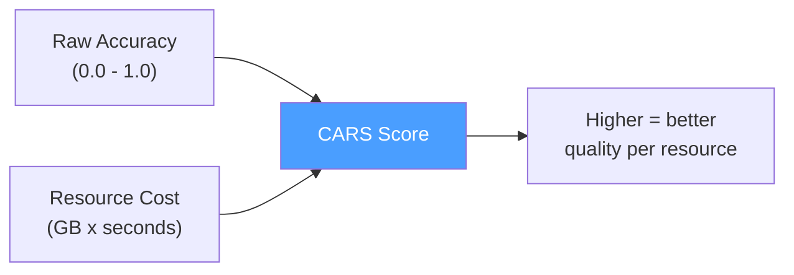

# soul-bench

**CARS benchmark — evaluating LLMs by quality per dollar per second.**


A 10-task, 33-prompt benchmark suite that introduces the **CARS (Cost-Adjusted Relative Score)** metric. Leaderboards rank accuracy. Production ranks cost. CARS measures what actually matters: **quality per dollar per second**.

---

## Why soul-bench?

Most LLM benchmarks answer "which model is most accurate?" That's the wrong question for production. The right question is: **which model gives the best results for the resources it consumes?**

A model that's 95% as accurate at 10% the cost is often the right choice. CARS captures this tradeoff in a single number.

---

## CARS Metric

Three variants for different deployment targets:

```
CARS_RAM  = Accuracy / (Peak_RAM_GB x Latency_s)     # CPU inference
CARS_Size = Accuracy / (Model_Size_GB x Latency_s)    # Any hardware (reproducible)
CARS_VRAM = Accuracy / (Peak_VRAM_GB x Latency_s)     # GPU inference
```



**Higher is better.** CARS reveals which models give the best bang-per-resource — not just the highest accuracy.

---

## Benchmark Results (Google Colab T4 GPU)

| Model | Size | Accuracy | Latency | VRAM | Tok/s | CARS_Size | CARS_VRAM |
|-------|------|----------|---------|------|-------|-----------|-----------|
| **Qwen2.5-3B-Instruct Q4_K_M** | 1.96 GB | **78.5%** | **2.06s** | **2,347 MB** | 48.18 | **0.1948** | **0.1666** |
| Phi-3.5-mini-instruct Q4_K_M | 2.23 GB | 62.4% | 3.89s | 3,297 MB | 51.75 | 0.0721 | 0.0499 |

Qwen2.5-3B wins on accuracy (+16%), latency (1.9x faster), VRAM (29% less), and CARS (2.7-3.3x higher).

### Category Breakdown

| Category | Phi-3.5-mini | Qwen2.5-3B |
|----------|-------------|------------|
| System health | 66.7% | **100%** |
| Code generation | **100%** | **100%** |
| Email drafting | **66.7%** | 33.3% |
| Contact research | **100%** | **100%** |
| Knowledge QA | **86.7%** | **86.7%** |
| Task planning | 33.3% | **50%** |
| Classification | 0% | **100%** |
| Campaign planning | **100%** | 60% |
| Reply classification | 33.3% | **66.7%** |
| Infra management | **66.7%** | **66.7%** |
| Reasoning | 0% | **100%** |

Full results in [`results/`](results/).

---

## 10 Task Categories (30 prompts + 3 smoke tests)

| # | Category | Prompts | Scoring | What It Tests |
|---|----------|---------|---------|---------------|
| 1 | System health | 3 | `json_schema` | JSON diagnosis from system snapshots |
| 2 | Code generation | 3 | `code_executes` | Python functions that compile and run |
| 3 | Email drafting | 3 | `json_schema` | Structured email from template + contact data |
| 4 | Contact research | 3 | `json_schema` | Enrichment JSON from name + company |
| 5 | Knowledge QA | 3 | `contains_keywords` | Factual extraction from provided context |
| 6 | Task planning | 3 | `json_schema` | Task assignment from agent roster |
| 7 | Classification | 3 | `exact_match_label` | Single-label content classification |
| 8 | Campaign planning | 3 | `ordered_steps` | Correct CLI pipeline step ordering |
| 9 | Reply classification | 3 | `exact_match_label` | Email reply intent (includes adversarial injection) |
| 10 | Infra management | 3 | `contains_keywords` | Infrastructure diagnosis with required terms |

## 7 Scoring Methods

All return fractional scores (0.0 to 1.0):

| Method | Type | Logic |
|--------|------|-------|
| `score_json_schema` | Fractional | Parse JSON, check required keys + field values |
| `score_contains_keywords` | Fractional | Case-insensitive keyword matching |
| `score_code_executes` | Binary | `compile()` + function name check |
| `score_ordered_steps` | Fractional | Verify step ordering constraints |
| `score_exact_match_label` | Binary | Exact case-insensitive label match |
| `score_exact_match_number` | Binary | Last number in response matches expected |
| `score_contains_function` | Binary | Function definition substring check |

---

## Quick Start

### CPU (local machine with llama.cpp)

```bash
git clone https://github.com/rishav1305/soul-bench.git
cd soul-bench

# Run full suite
python3 scripts/benchmark.py --prompts prompts/ --results-dir results/

# Run single category
python3 scripts/benchmark.py --prompts prompts/01-system-health.json

# Run tests
python3 -m pytest tests/ -v  # 39 tests
```

### GPU (Google Colab, free tier T4)

```bash
# Option 1: Use the notebook
# Open notebooks/cars_benchmark.ipynb in Colab, enable T4 GPU, run all cells

# Option 2: CLI with GPU flag
pip install 'llama-cpp-python>=0.3' \
  --extra-index-url https://abetlen.github.io/llama-cpp-python/whl/cu124
python3 scripts/benchmark.py --prompts prompts/ --results-dir results/ --gpu
```

---

## Project Structure

```
soul-bench/
├── prompts/
│   ├── smoke-test.json           # 3 smoke test prompts
│   ├── 01-system-health.json     # 3 prompts per category
│   └── ...10-infra-management.json
├── scripts/
│   ├── benchmark.py              # Main benchmark runner
│   ├── scoring.py                # 7 scoring methods
│   ├── colab_setup.py            # Google Colab setup
│   └── setup-titan.sh            # Local machine setup
├── notebooks/
│   └── cars_benchmark.ipynb      # Colab notebook (GPU)
├── results/
│   ├── BASELINE.md               # CPU baseline report
│   └── *.json / *.md             # Benchmark results + reports
└── tests/
    ├── test_scoring.py           # 25 scoring tests
    └── test_benchmark.py         # 14 benchmark tests
```

## Reports

- [CARS Baseline Report](results/2026-02-22-cars-baseline-report.md) — CPU-only, smoke test prompts
- [Full Suite Report](results/2026-02-23-soul-bench-full-suite-report.md) — 33 prompts, 10 categories, GPU results

## Design Decisions

- **Real workloads** — all 10 categories derived from actual production tasks, not synthetic benchmarks
- **Reproducible** — fixed prompts, deterministic scoring, temperature=0.0
- **Fractional scoring** — partial credit (0.0-1.0) instead of binary pass/fail
- **Adversarial testing** — prompt injection resistance test in reply classification
- **CARS is the primary ranking metric** — not just accuracy, cost-efficiency for real deployments

---

## Related Projects

| Repo | What it does |
|------|-------------|
| [SoulGraph](https://github.com/rishav1305/soulgraph) | Multi-agent framework with built-in RAGAS evaluation |
| [soul-team](https://github.com/rishav1305/soul-team) | Multi-agent runtime — distributed coordination across machines |
| [soul](https://github.com/rishav1305/soul) | Full-stack AI platform — the system soul-bench was built to evaluate |

---

## License

MIT — see [LICENSE](LICENSE).

---

Built by [Rishav Chatterjee](https://rishavchatterjee.com) · [LinkedIn](https://linkedin.com/in/rishavchatterjee) · [GitHub](https://github.com/rishav1305)
